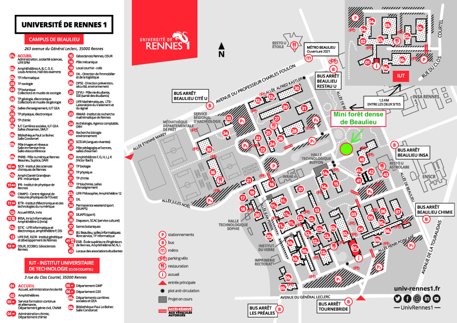

# Cours ISTIC

Liste des cours disponibles publiquement que nous sommes autorisé à diffuser

* COMPTE OFFICIEL GITHUB des étudiants https://github.com/istic-student 
* COMPTE OFFICIEL GITHUB des profs https://github.com/ISTICUniversityOfRennes1 (to be changed to istic-school after big decisions) 
* SITE DU BDE https://lapalme.netlify.app/ (temporaire ? ou remplacant de https://bde-palme.fr sur YAPLA ?)
* SITE PALME OFFICIEL https://etudiant.univ-rennes1.fr/palme (TODO 31/08/2022 changer le LOGO 2020-2021)

Les bâtiments de cours sont 12D et 2B (aussi appelé bato) principalement et éventuellement le 42 et le 2A parfois

La licence c'est 60h de travail dont 20h de cours par semaine

Un crédit c'est 25-30 heures de travail (perso + cours), une U.E. de 5 crédits est donc entre 125 et 150 heures de travail, une année de licence c'est 60 crédits

À raison de 14 semaine par semestre ça ferait 65h par semaine

Les TD ne sont pas obligatoires comme les CM juste qu'ils font l'appel aux TD et a la fin de l'année si tu es juste le jury est moins sympa si tu a beaucoup d'absences.  Les TP eux tu à la droit à 1 absence non justifiée par TP après ça tu as 0 en note de TP

# Index

- Licence 1
- [Licence 2](L2.md)
- [Licence 3](L3.md)
- Master 1
- [Master 2](M2.md)
- Doctorat

# More

https://www.notion.so/Universit-bb2afc9619484bb0a2d801f2b807036c
